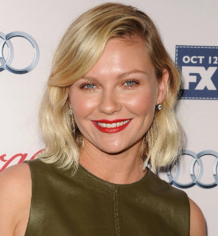
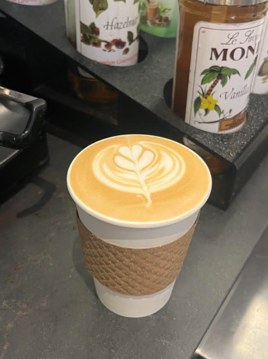
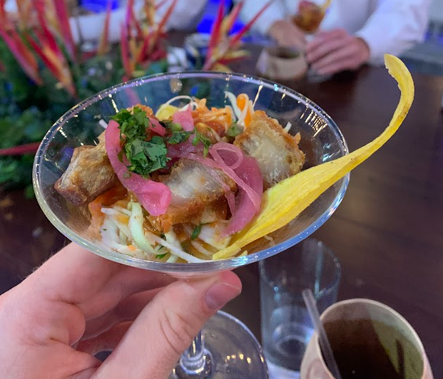
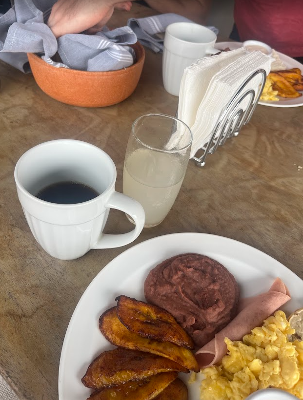
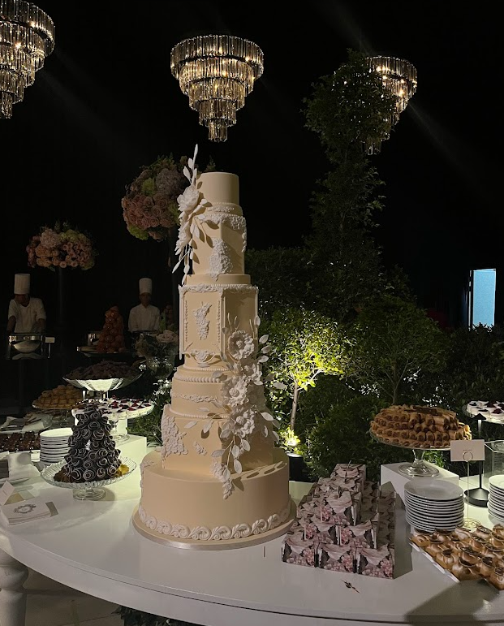

# Michelle Langnickel

### Food Scientist • Product Development • Culinary R&D

*"Creating products people remember."*

 

---

# Featured Work

<table>
<tr>
<td width="55%">

</td>

<td width="45%">

## Breakfast Collection

A complete breakfast menu developed for a new Edible Brands concept.

From early market research and competitive analysis through recipe formulation,
iterative testing, and launch preparation, this project explored how fresh fruit
could expand beyond gifting into an everyday breakfast experience.

**Highlights**

• Complete menu concept

• Recipe development

• Consumer-focused formulation

• Launch support

</td>
</tr>
</table>

---

<table>
<tr>
<td width="53%">

## Chocolate & Fruit Desserts

A collection of ready-to-eat desserts balancing premium presentation,
freshness, and operational consistency.

Recipes were refined through multiple rounds of testing with a focus on
flavor, texture, appearance, and production efficiency.

</td>

<td width="55%">

</td>
</tr>
</table>

---

# Gallery

| | |
|---|---|
<table align="center" width="100%">
  <tr>
    <td width="50%" height="250" align="center" valign="middle">
      
    </td>
    <td width="50%" height="250" align="center" valign="middle">
      
    </td>
  </tr>
  <tr>
    <td width="50%" height="250" align="center" valign="middle">
      
    </td>
    <td width="50%" height="250" align="center" valign="middle">
      
    </td>
  </tr>
</table>

*A selection of products created for development, photography, and launch.*

---

<table>
<tr>
<td width="55%">

</td>

<td width="45%">

## Fruit Arrangement Design

Developed seasonal fruit arrangements with an emphasis on visual appeal,
production efficiency, and brand consistency.

Projects included concept sketches, production testing, refinement,
and preparation for training and promotional materials.

</td>
</tr>
</table>

---

# Behind the Scenes

<table>

<tr>
<td>

</td>

<td>

</td>

<td>

</td>

</tr>

<tr>
<td align="center">

Prototype

</td>

<td align="center">

Testing

</td>

<td align="center">

Final Product

</td>

</tr>

</table>

---

<table>
<tr>

<td width="45%">

## Product Photography

Many of these products were prepared for professional photography,
marketing campaigns, social media, and internal training.

Attention to detail extended beyond flavor—every garnish, cut, and finish
needed to communicate quality.

</td>

<td width="55%">

</td>

</tr>
</table>

---

# University Project

### Gluten-Free Raspberry Muffin

A senior capstone focused on developing a gluten-free, high-fiber muffin using
consumer insights, specialty ingredients, and extensive shelf-life,
microbial, chemical, and sensory testing.

---

### Thanks for visiting.

📧 <a href="mailto:mlangz922@gmail.com">mlangz922@gmail.com</a>

<a href="https://www.linkedin.com/in/michelle-langnickel-5728891b5/">LinkedIn</a> • <a href="https://github.com/MLangnickel">Portfolio</a>

