

# Michelle Langnickel

### Food Scientist • Product Development • Culinary Innovation

*"Combining science and creativity in the form of food."*

 

---

# Featured Work

<table>
<tr>
<td width="55%">

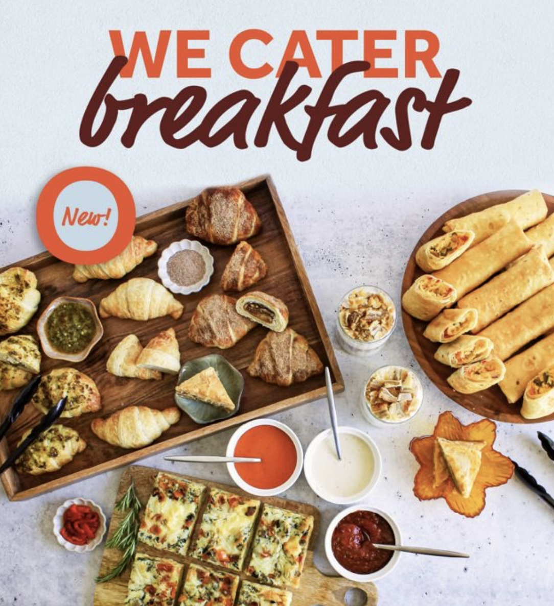

</td>

<td width="45%">

## Mediterranean Breakfast Collection

A complete breakfast menu developed for a new Edible Brands concept.

From early market research and ideation through recipe formulation, testing, and launch preparation, this project explored how a well-established Mediterranean restaurant could expand into the breakfast market using ingredients already offered in stores.

**Highlights**

• Complete menu concept

• Recipe development

• Consumer-focused formulation

• Launch support

</td>
</tr>
</table>

---

<table>
<tr>
<td width="53%">

## Mercedez Benz Collaboration

A collection of ready-to-eat desserts balancing premium presentation,
freshness, and operational consistency for the launch of a new location in Mercedez Benz Stadium.

Recipes were refined through multiple rounds of testing with a focus on
appearance and presentation, brand consistency, and production efficiency. Professional videos and images were taken of the styled items for marketing throughout the stadium during Atlanta Falcons games.

</td>

<td width="55%">

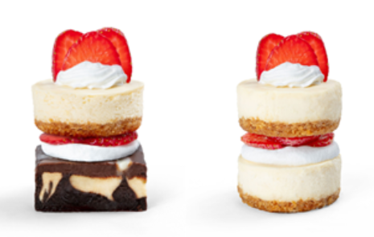

</td>
</tr>
</table>

---

# Gallery

<table align="center" width="100%">
  <tr>
    <td width="50%" height="250" align="center" valign="middle">
      
    </td>
    <td width="50%" height="250" align="center" valign="middle">
      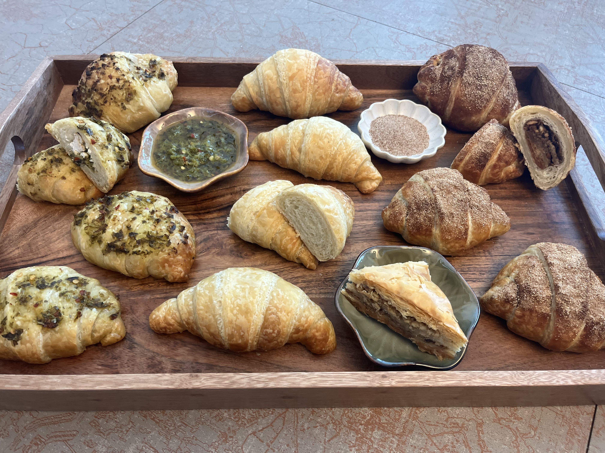
    </td>
  </tr>
  <tr>
    <td width="50%" height="250" align="center" valign="middle">
      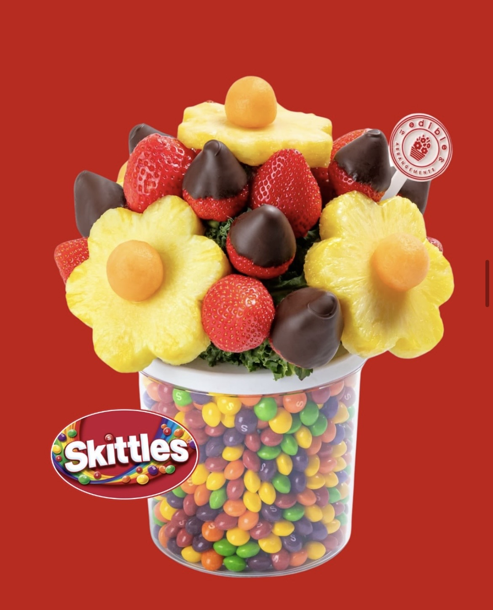
    </td>
    <td width="50%" height="250" align="center" valign="middle">
      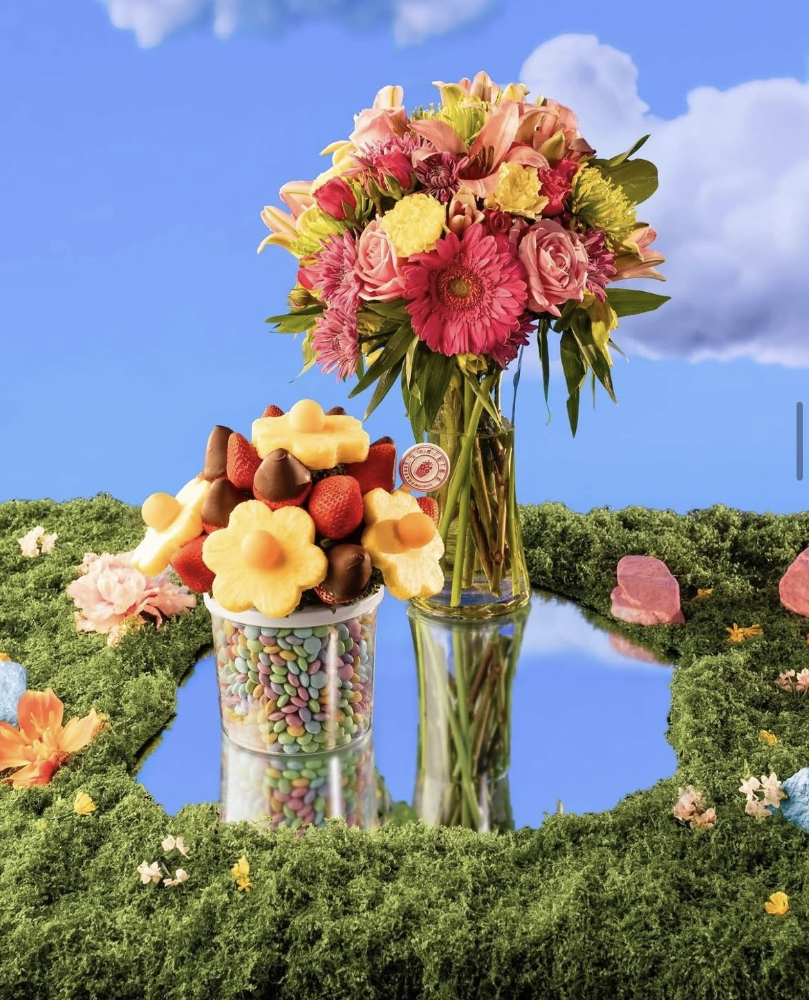
    </td>
  </tr>

 <td width="50%" height="250" align="center" valign="middle">
      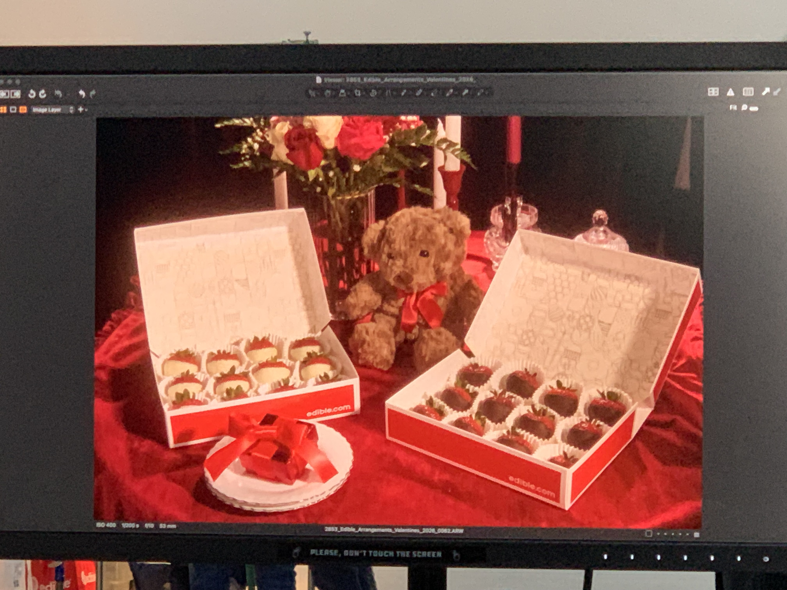
    </td>
    <td width="50%" height="250" align="center" valign="middle">
      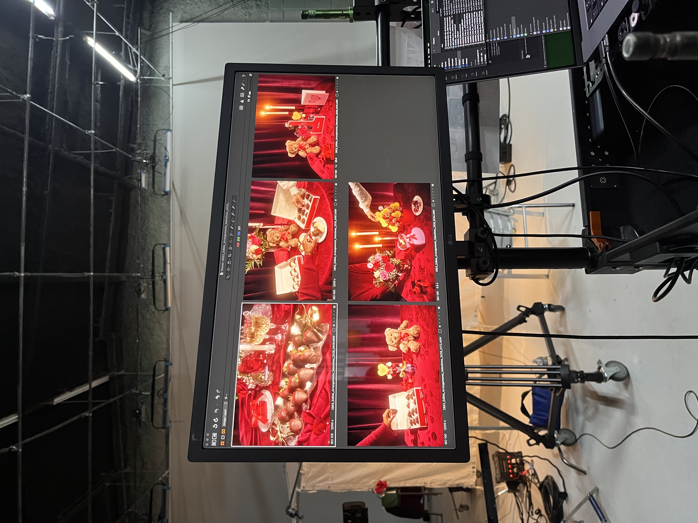
    </td>
  </tr>
</table>
*A selection of products created for development, photography, and launch.*

---

<table>
<tr>
<td width="55%">

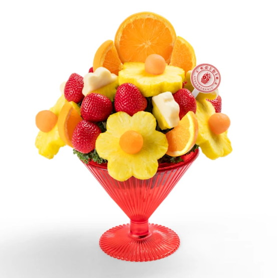

</td>

<td width="45%">

## Fruit Arrangement Design

Developed seasonal fruit arrangements with an emphasis on visual appeal,
production efficiency, and brand consistency.

Projects included ideation, recipe testing, refinement,
and preparation for training and promotional materials.

</td>
</tr>
</table>

## Product Photography

Many of these products were prepared for professional photography,
marketing campaigns, social media, and internal training.

Attention to detail extended beyond flavor, as every piece of fruit, dip of chocolate, and placement within the arrangement or board needed to communicate quality.

<table align="center" width="100%">
  <tr>
    <td width="50%" height="250" align="center" valign="middle">
      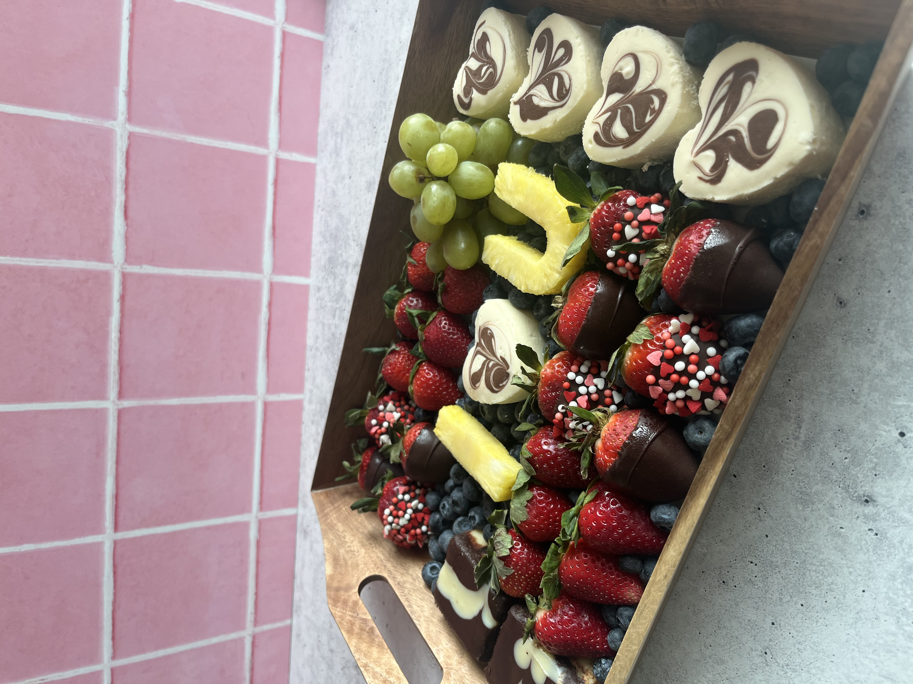
    </td>
    <td width="50%" height="250" align="center" valign="middle">
      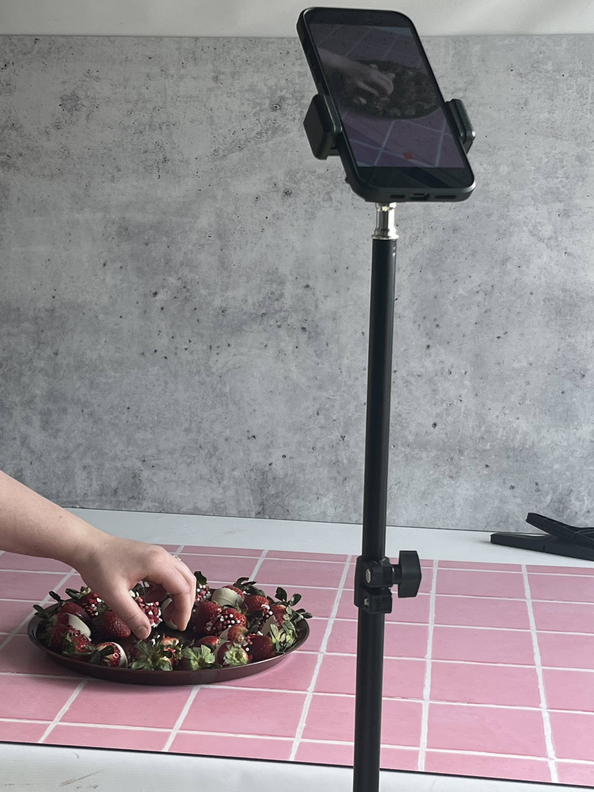
    </td>

<td width="55%">

</table>

---

# Capstone Project

    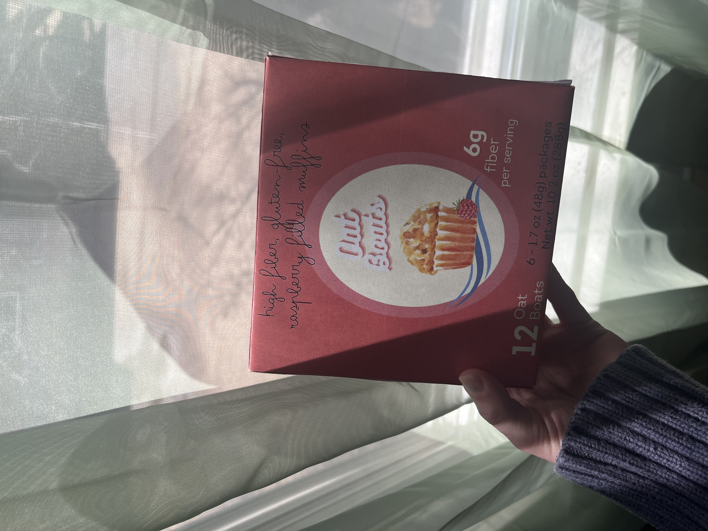

<table align="center" width="100%">
  <tr>
    <td width="50%" height="250" align="center" valign="middle">
      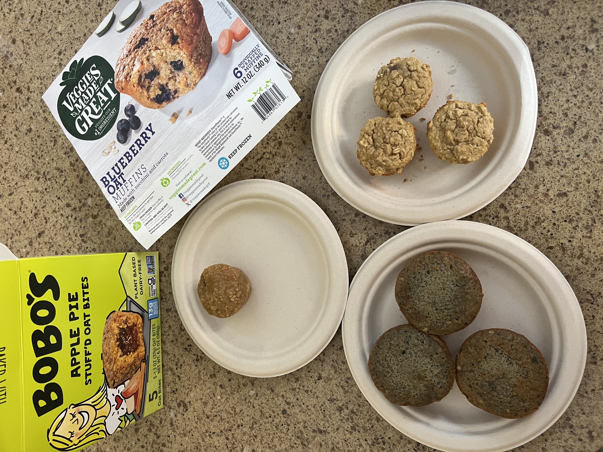
    </td>
    <td width="50%" height="250" align="center" valign="middle">
      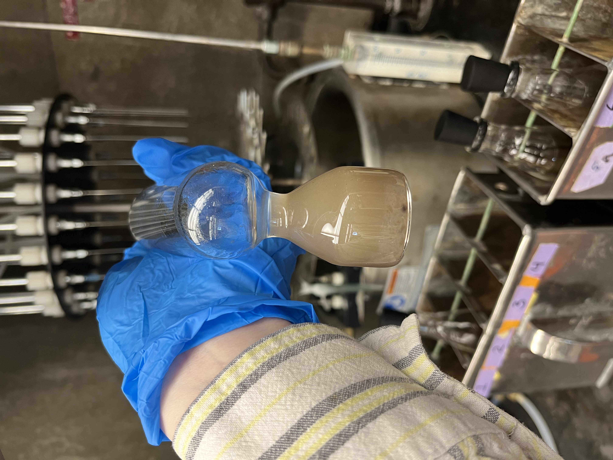
    </td>
  </tr>
</table>

### Oat Boats Muffin

A senior capstone project focused on developing a gluten-free, high-fiber, raspberry-filled muffin using
consumer insights, specialty ingredients, and extensive shelf-life,
microbial, chemical, and sensory testing.

---

### Thank you for visiting!

📧 <a href="mailto:mlangnickel02@gmail.com">mlangnickel02@gmail.com</a>

<a href="https://www.linkedin.com/in/michelle-langnickel-5728891b5/">LinkedIn</a> • <a href="https://github.com/MLangnickel">Portfolio</a>

